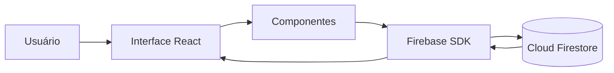

<div align="center">

# 📚 Biblioteca de Livros

### CRUD desenvolvido com React.js, Firebase Firestore e Bootstrap

Projeto acadêmico desenvolvido durante o webinar da disciplina de **Tecnologias Emergentes**, com o objetivo de demonstrar a criação de uma aplicação web integrada a um banco de dados em nuvem.


</div>

---

## 📖 Sobre o projeto

A **Biblioteca de Livros** é uma aplicação web para gerenciamento de um catálogo de livros.

O projeto permite realizar as principais operações de um CRUD:

* cadastrar novos livros;
* visualizar os livros cadastrados;
* editar informações existentes;
* excluir livros;
* armazenar os dados em nuvem utilizando o Firebase Firestore.

A aplicação foi criada como material prático para demonstrar a integração entre uma interface desenvolvida com React.js e um serviço de banco de dados NoSQL em nuvem.

---

## 🎓 Contexto acadêmico

Este projeto foi desenvolvido como material de apoio para um webinar da disciplina de **Tecnologias Emergentes**, do curso de **Análise e Desenvolvimento de Sistemas**.

O principal objetivo do webinar foi apresentar, de forma prática, os conceitos fundamentais de **Git** e **GitHub**, utilizando uma aplicação desenvolvida em **React.js** integrada ao **Firebase Firestore** como estudo de caso. Durante o encontro, os alunos aprenderam sobre controle de versão, fluxo de trabalho com Git, criação e gerenciamento de repositórios, commits, branches, merge, resolução de conflitos e publicação de projetos no GitHub, aproximando-os das práticas adotadas no mercado de desenvolvimento de software.

---

## 🎯 Objetivos de aprendizagem

Ao longo do webinar, os alunos desenvolveram uma aplicação web enquanto aplicavam, na prática, os principais conceitos de **Git** e **GitHub**. Entre os conhecimentos abordados, destacam-se:

### Git e GitHub

- configuração do ambiente de desenvolvimento;
- inicialização e clonagem de repositórios;
- controle de versão utilizando Git;
- criação e gerenciamento de branches;
- realização de commits seguindo boas práticas;
- merge e resolução de conflitos;
- publicação e versionamento de projetos no GitHub.

### Desenvolvimento da aplicação

- criação de aplicações web com React.js;
- desenvolvimento de componentes reutilizáveis;
- gerenciamento de estado utilizando React Hooks;
- implementação das operações de cadastro, consulta, edição e exclusão (CRUD);
- integração de uma aplicação React com o Firebase Firestore;
- utilização de banco de dados NoSQL em nuvem;
- estilização da interface com Bootstrap;
- organização da estrutura de um projeto front-end.

---

## ✨ Funcionalidades

* ✅ Cadastro de livros
* ✅ Listagem dos livros cadastrados
* ✅ Edição de livros
* ✅ Exclusão de livros
* ✅ Atualização da interface após alterações
* ✅ Persistência de dados no Firebase Firestore
* ✅ Interface responsiva com Bootstrap

---

## 📚 Dados dos livros

Cada livro possui os seguintes campos:

| Campo     | Descrição                     |
| --------- | ----------------------------- |
| Título    | Nome do livro                 |
| Autor     | Pessoa autora da obra         |
| Ano       | Ano de publicação             |
| Categoria | Categoria ou gênero literário |

---

## 🛠️ Tecnologias utilizadas

### Front-end

* **React.js** — construção da interface e dos componentes;
* **JavaScript** — implementação da lógica da aplicação;
* **Bootstrap 5** — estilização e responsividade;
* **CSS** — personalização visual da aplicação.

### Banco de dados

* **Firebase Firestore** — armazenamento dos dados em nuvem;
* **Firebase SDK** — integração entre o React e os serviços do Firebase.

### Ferramentas

* **Create React App**
* **npm**
* **Git**
* **GitHub**

---

## 🏗️ Arquitetura da aplicação

A aplicação possui uma arquitetura simples, adequada ao objetivo didático do projeto.



O React é responsável pela interface e pelo gerenciamento das interações do usuário. As operações de leitura e gravação são realizadas diretamente no Firebase Firestore por meio do SDK do Firebase.

---

## 📁 Estrutura do projeto

```text
ProjetoWebinarTecnologiasEmergentes/
│
├── web/
│   ├── public/
│   │   └── index.html
│   │
│   ├── src/
│   │   ├── components/
│   │   │   └── LivroForm.js
│   │   │
│   │   ├── config/
│   │   │   └── Firebase.js
│   │   │
│   │   ├── App.css
│   │   ├── App.js
│   │   ├── App.test.js
│   │   ├── index.css
│   │   ├── index.js
│   │   ├── reportWebVitals.js
│   │   └── setupTests.js
│   │
│   ├── .gitignore
│   ├── package.json
│   └── package-lock.json
│
└── README.md
```

---

## 🔄 Fluxo das operações

### Cadastro

1. A pessoa usuária preenche o formulário.
2. A aplicação valida e recebe os dados.
3. O Firebase SDK envia as informações ao Firestore.
4. O novo livro é armazenado no banco.
5. A listagem é atualizada na interface.

### Edição

1. A pessoa usuária seleciona um livro.
2. Os dados são carregados no formulário.
3. As informações são alteradas.
4. O documento correspondente é atualizado no Firestore.

### Exclusão

1. A pessoa usuária seleciona a opção de exclusão.
2. A aplicação identifica o documento.
3. O registro é removido do Firestore.
4. A listagem é atualizada.

---

## ⚙️ Como executar

### Pré-requisitos

Antes de começar, tenha instalado:

* Node.js;
* npm;
* Git;
* uma conta no Firebase.

---

### 1. Clone o repositório

```bash
git clone https://github.com/leticia-gomes/webinar-react-firebase-library.git
```

### 2. Entre na pasta da aplicação

```bash
cd ProjetoWebinarTecnologiasEmergentes/web
```

### 3. Instale as dependências

```bash
npm install
```

### 4. Configure o Firebase

Crie um projeto no Firebase e habilite o **Cloud Firestore**.

Em seguida, configure o arquivo:

```text
src/config/Firebase.js
```

Exemplo:

```javascript
import { initializeApp } from 'firebase/app';
import { getFirestore } from 'firebase/firestore';

const firebaseConfig = {
  apiKey: 'SUA_API_KEY',
  authDomain: 'SEU_PROJETO.firebaseapp.com',
  projectId: 'SEU_PROJECT_ID',
  storageBucket: 'SEU_STORAGE_BUCKET',
  messagingSenderId: 'SEU_MESSAGING_SENDER_ID',
  appId: 'SEU_APP_ID',
};

const app = initializeApp(firebaseConfig);

export const db = getFirestore(app);
```

### 5. Execute a aplicação

```bash
npm start
```

A aplicação ficará disponível em:

```text
http://localhost:3000
```

### 6. Encerre o servidor

No terminal, pressione:

```text
Ctrl + C
```

---

## 🔐 Configuração e segurança

As configurações do Firebase identificam o projeto utilizado pela aplicação. Em projetos reais, também é importante configurar corretamente as regras de segurança do Firestore.

Exemplo de configuração para desenvolvimento:

```javascript
rules_version = '2';

service cloud.firestore {
  match /databases/{database}/documents {
    match /livros/{document} {
      allow read, write: if true;
    }
  }
}
```

> Essa configuração libera leitura e escrita para qualquer pessoa e deve ser utilizada apenas durante estudos e desenvolvimento.

Para uma aplicação em produção, as regras devem exigir autenticação e limitar o acesso aos dados.

---

## 🧠 Conceitos abordados

* React Components
* React State
* Manipulação de formulários
* CRUD
* Banco de dados NoSQL
* Firebase Firestore
* Integração com serviços em nuvem
* Programação assíncrona
* Responsividade com Bootstrap
* Organização de projetos front-end
* Git e GitHub

---

## 🚀 Possíveis melhorias

* implementar autenticação com Firebase Authentication;
* criar uma busca por título ou autor;
* adicionar filtros por categoria;
* implementar paginação;
* incluir validação dos campos do formulário;
* exibir mensagens de sucesso e erro;
* solicitar confirmação antes da exclusão;
* adicionar capa e descrição aos livros;
* criar testes para os componentes;
* publicar a aplicação no Firebase Hosting;
* desenvolver uma versão mobile com React Native e Expo.

---

## 👩‍🏫 Sobre o webinar

Este projeto foi desenvolvido durante um webinar da disciplina de **Tecnologias Emergentes** e utilizado como exemplo prático para demonstrar o uso do **Git** e do **GitHub** no desenvolvimento de software.

A aplicação, construída com **React.js** e **Firebase Firestore**, serviu como base para apresentar conceitos como controle de versão, fluxo de trabalho com Git, criação e gerenciamento de repositórios, commits, branches, merge, resolução de conflitos e publicação de projetos no GitHub, aproximando os alunos das práticas utilizadas no mercado de desenvolvimento de software.

---

## 👩‍💻 Autora

**Letícia Gomes Ribeiro**

Desenvolvedora Full Stack e Professora Universitária.

[](https://github.com/leticia-gomes)

---

## 📄 Licença

Este projeto foi desenvolvido para fins acadêmicos e educacionais.

Caso deseje distribuí-lo sob a licença MIT, adicione um arquivo `LICENSE` na raiz do repositório.

---

<div align="center">

Desenvolvido para compartilhar conhecimento e apoiar o aprendizado de novas tecnologias. 💻📚

</div>
